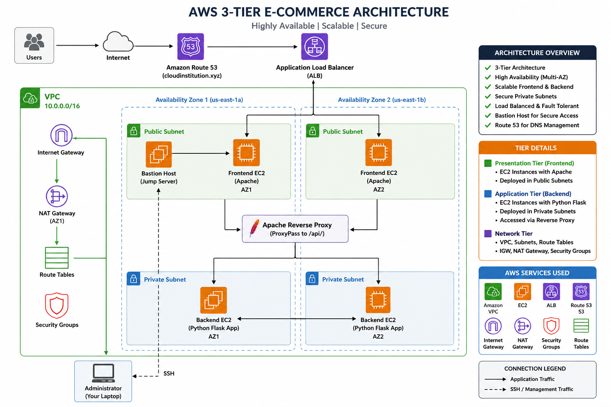

# 🚀 Highly Available & Scalable 3-Tier E-Commerce Architecture on AWS

## 📌 Project Overview

This project demonstrates the deployment of a **Highly Available and Scalable 3-Tier E-Commerce Application** on Amazon Web Services (AWS).

The architecture follows AWS best practices by separating the application into **Presentation Tier (Frontend)**, **Application Tier (Backend)**, and **Networking Layer**, providing high availability, scalability, security, and fault tolerance.

---

## 🏗️ Architecture Diagram



---

## ⚙️ AWS Services Used

- Amazon EC2
- Amazon VPC
- Public & Private Subnets
- Internet Gateway
- NAT Gateway
- Route Tables
- Security Groups
- Application Load Balancer (ALB)
- Route 53
- Apache HTTP Server
- Python Flask
- Git
- Linux (Amazon Linux)

---

## 🏛️ Architecture

```
                    Internet
                        │
                  Amazon Route 53
                        │
          Application Load Balancer
                        │
        ┌───────────────┴───────────────┐
        │                               │
Frontend EC2 (AZ1)              Frontend EC2 (AZ2)
     Apache HTTP Server       Apache HTTP Server
        │                               │
        └───────────────┬───────────────┘
                        │
              Apache Reverse Proxy
                        │
        ┌───────────────┴───────────────┐
        │                               │
Backend EC2 (AZ1)               Backend EC2 (AZ2)
Python Flask Application   Python Flask Application
                        ▲
                        │
                 Bastion Host
                        │
                 Administrator
```

---

## ✨ Features

- Highly Available Multi-AZ Deployment
- Scalable 3-Tier Architecture
- Public & Private Subnet Design
- Application Load Balancer
- Apache Reverse Proxy
- Python Flask Backend
- Bastion Host for Secure SSH Access
- Route 53 Custom Domain Routing
- Secure Network Segmentation
- Fault-Tolerant Architecture

---

## 🌐 Network Architecture

- Custom VPC
- 2 Public Subnets
- 2 Private Subnets
- Internet Gateway
- NAT Gateway
- Route Tables
- Security Groups

---

## 🖥️ Frontend Tier

- Apache HTTP Server
- Static Web Application
- Reverse Proxy Configuration
- Load Balanced Across Two EC2 Instances

---

## ⚙️ Backend Tier

- Python Flask Application
- Running on Private EC2 Instances
- Accessed only through Frontend Servers
- High Availability Across Availability Zones

---

## 🔒 Security

- Bastion Host for Secure Administration
- Backend Instances Deployed in Private Subnets
- Security Groups Restrict Direct Access
- Controlled SSH Access
- Layered Network Security

---

## 📸 Project Screenshots

### Architecture Diagram


### AWS Infrastructure

> Add your AWS Console screenshots in the `screenshots` folder and reference them here.

---

## 📂 Project Structure

```
aws-3tier-ecommerce-ha-project/
│
├── README.md
│
├── architecture/
│   └── architecture-diagram.png
│
├── scripts/
│   ├── frontend-setup.sh
│   └── backend-setup.sh
│
├── apache/
│   └── backend-proxy.conf
│
├── docs/
│   ├── deployment-steps.md
│   └── interview-notes.md
```

---

## 🚀 Deployment Workflow

1. Created Custom VPC
2. Created Public & Private Subnets
3. Configured Internet Gateway
4. Configured NAT Gateway
5. Created Route Tables
6. Launched Bastion Host
7. Launched Frontend EC2 Instances
8. Launched Backend EC2 Instances
9. Installed Apache Web Server
10. Installed Python & Dependencies
11. Configured Apache Reverse Proxy
12. Configured Application Load Balancer
13. Configured Route 53
14. Verified High Availability
15. Tested End-to-End Application Deployment

---

## 💻 Technologies Used

- AWS
- Linux
- Apache HTTP Server
- Python Flask
- Git
- Shell Scripting
- Networking
- Load Balancing
- DNS

---

## 🎯 Skills Demonstrated

- AWS Cloud Architecture
- High Availability
- Scalable Infrastructure
- Networking
- Linux Administration
- Web Server Configuration
- Reverse Proxy
- Load Balancing
- Route 53 DNS Management
- EC2 Administration
- Infrastructure Deployment
- Cloud Security

---

## 📖 Learning Outcomes

- Designed a Production-Style AWS Architecture
- Implemented High Availability
- Configured Load Balancing
- Managed Public and Private Networking
- Configured Secure Access Using Bastion Host
- Deployed a Multi-Tier Web Application
- Implemented DNS Routing with Route 53

---

## 👨‍💻 Author

**Kiran Marishetti**

Cloud & DevOps Engineer

**Skills:** AWS • Azure • Linux • Git • GitHub • Jenkins • Docker • Kubernetes • Terraform • Ansible • Python • Shell Scripting • CI/CD

---

⭐ If you found this project helpful, consider giving it a star.