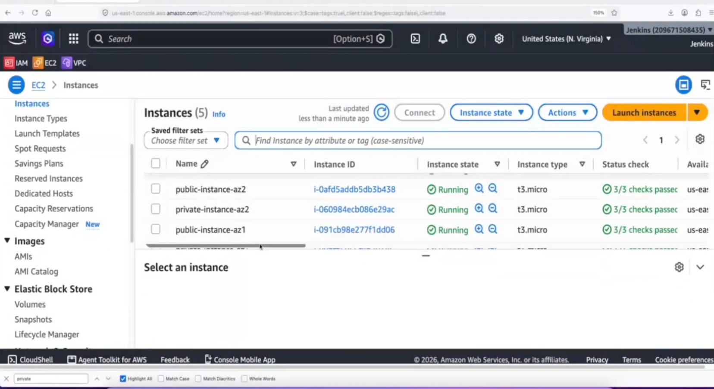
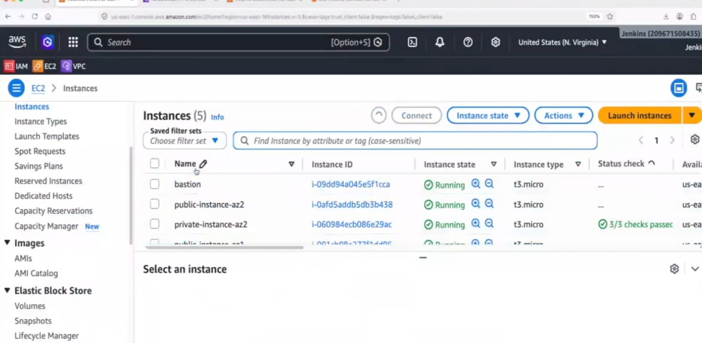

# 🚀 AWS 3-Tier Highly Available & Scalable E-Commerce Application

## 📌 Overview

This project demonstrates the deployment of a **Highly Available and Scalable 3-Tier E-Commerce Application** on AWS. The application is deployed using a secure, production-style architecture with separate frontend and backend tiers, public and private subnets, and load balancing for high availability.

---

## 🏗️ Architecture


---

## 🚀 AWS Services Used

- Amazon VPC
- Public & Private Subnets
- Amazon EC2
- Internet Gateway
- NAT Gateway
- Route Tables
- Security Groups
- Application Load Balancer (ALB)
- Route 53
- Apache HTTP Server
- Python Flask
- Git
- Linux (Amazon Linux)

---

## 🏛️ Architecture Components

- 1 Custom VPC
- 2 Public Subnets
- 2 Private Subnets
- 1 Internet Gateway
- 1 NAT Gateway
- 1 Application Load Balancer
- 2 Frontend EC2 Instances (Apache)
- 2 Backend EC2 Instances (Python Flask)
- 1 Bastion Host
- Route 53 for Custom Domain Routing

---

## 📂 Project Structure

```text
aws-3tier-ecommerce-ha-project/
│
├── README.md
├── architecture/
│   └── architecture.png
├── screenshots/
├── scripts/
│   ├── frontend-setup.sh
│   └── backend-setup.sh
├── apache/
│   └── backend-proxy.conf
└── docs/
    ├── deployment-steps.md
    └── interview-notes.md
```

---

## ✨ Key Features

- Highly Available Multi-AZ Deployment
- Scalable 3-Tier Architecture
- Public & Private Subnet Design
- Application Load Balancer
- Apache Reverse Proxy
- Python Flask Backend
- Bastion Host for Secure SSH Access
- Route 53 Custom Domain
- Secure Network Architecture

---

## 🌐 Architecture Workflow

```text
Internet
   │
Route 53
   │
Application Load Balancer
   │
├───────────────┬───────────────┤
│                               │
Frontend EC2 (AZ1)       Frontend EC2 (AZ2)
(Apache)                 (Apache)
│                               │
└───────────────┬───────────────┘
                │
      Apache Reverse Proxy
                │
├───────────────┬───────────────┤
│                               │
Backend EC2 (AZ1)        Backend EC2 (AZ2)
(Python Flask)           (Python Flask)

Administrator
      │
Bastion Host
      │
Private Backend Servers
```

---

## 🚀 Deployment Steps

1. Created a custom VPC.
2. Created two public and two private subnets.
3. Attached an Internet Gateway.
4. Configured a NAT Gateway.
5. Created public and private route tables.
6. Launched a Bastion Host.
7. Deployed two frontend EC2 instances running Apache HTTP Server.
8. Deployed two backend EC2 instances running a Python Flask application.
9. Configured Apache Reverse Proxy to forward API requests.
10. Configured an Application Load Balancer.
11. Configured Route 53 for custom domain routing.
12. Verified high availability and application access.

---

## 💻 Technologies

- AWS
- Linux
- Apache HTTP Server
- Python Flask
- Git
- Shell Scripting
- Networking

---

## 🎯 Skills Demonstrated

- AWS Cloud Architecture
- VPC Networking
- High Availability
- Load Balancing
- Route 53 DNS Management
- EC2 Administration
- Linux Administration
- Reverse Proxy Configuration
- Cloud Security
- Multi-Tier Application Deployment

---

## 📸 Project Screenshots

### Architecture Overview


---

### EC2 Instances



---

### Bastion Host



---

### Private Subnets


---

### Application Load Balancer


---

### Route 53 Configuration


---

### Application Home Page


---

## 📖 Learning Outcomes

- Designed a Highly Available AWS 3-Tier Architecture
- Configured Public and Private Subnets
- Implemented Secure Access using Bastion Host
- Configured Apache Reverse Proxy
- Deployed Python Flask Application
- Configured Application Load Balancer
- Implemented Route 53 DNS Routing

---

## 👨‍💻 Author

**Kiran Marishetti**

Cloud & DevOps Engineer

**Skills:** AWS • Azure • Linux • Git • GitHub • Jenkins • Docker • Kubernetes • Terraform • Ansible • Python • Shell Scripting • CI/CD

---

## 📄 License

This project is for learning and demonstration purposes.